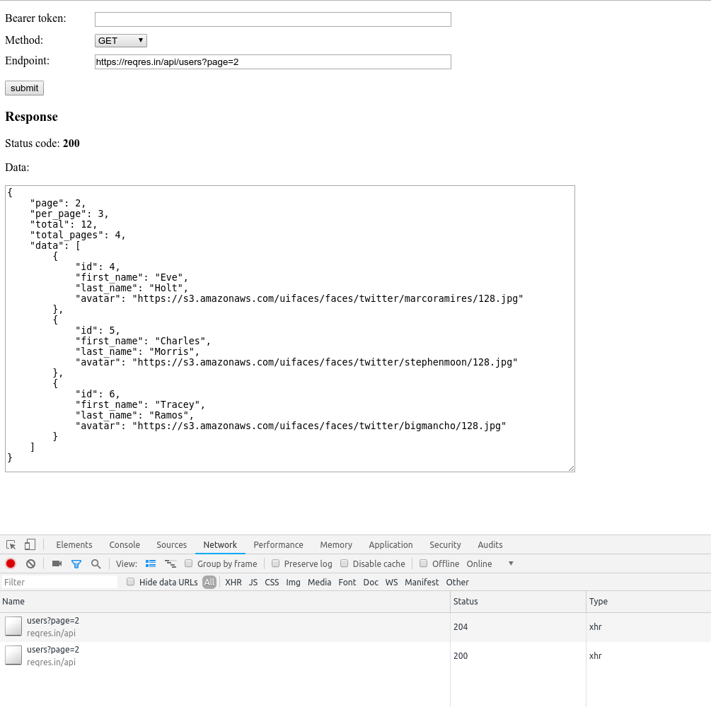

CORS Debug Page
===============

This is a single page script that was designed to test and debug CORS related issues in a standalone environment. CORS debugging can be tricky so this little tool is can be used to isolate any concerns. 

Load the page and enter data into the fields and submit the form. Watch the network activity in your browser inspection tools to check if both the OPTIONS and real (GET, POST, PUT, etc.) request are being sent.

For more information on CORS, visit <a href="https://developer.mozilla.org/en-US/docs/Web/HTTP/CORS/Errors">Mozzila's page</a> about CORS issues.

